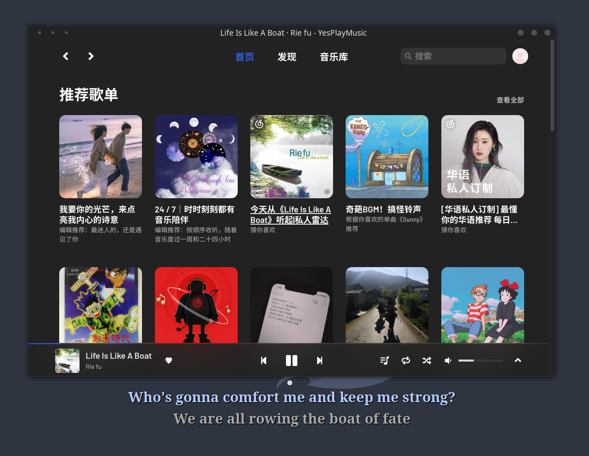

# YesPlayMusic Desktop Lyric for AwesomeWM



## 依赖

 [YesPlayMusic](https://github.com/qier222/YesPlayMusic) >= 0.3.8

## 安装

``` sh
# Clone 本项目到 AwesomeWM 配置目录
git clone https://github.com/meetcw/awm-ypm-lyrics.git ~/.config/awesome/awm-ypm-lyrics

```

setup 方法接收一个 wibox 或 wibar 作为参数。需要显示歌词时，插件会在这个 wibox 上查找 id 为 `current_lyric` 和 `next_lyric` 的文本控件用于显示歌词。

以下是我使用的配置代码：

<details>
<summary>查看代码</summary>

``` lua
local wibox = require('wibox')
local dpi = beautiful.xresources.apply_dpi
local ypm = require('awm-ypm-lyrics')
-- 创建用于显示歌词的 wibox
local function get_lyrics_wibox(args)
    local args = args or {}
    local current_fg = args.current_fg or '#b7cdff'
    local next_fg = args.next_fg or '#aaaaaa'
    local font = args.font or "20"
    local next_font = args.next_font or "15"
    local lyrics_wibox =
        wibox {
        screen = screen.primary,
        width = screen.primary.workarea.width,
        height = dpi(100),
        x = 0,
        y = screen.primary.workarea.height - dpi(100),
        bg = '#00000000',
        opacity = 1,
        visible = false,
        ontop = true,
        type = 'utility',
        input_passthrough = true
    }
    
    lyrics_wibox:setup {
        {
            {
                {
                    {
                        {
                            {
                                -- 插件会使用 id 为 `current_lyric` 的控件显示当前的歌词
                                id = 'current_lyric',
                                markup = '',
                                align = 'center',
                                valign = 'center',
                                font = font,
                                widget = wibox.widget.textbox
                            },
                            fg = '#000000',
                            widget = wibox.container.background
                        },
                        left = 2,
                        top = 2,
                        widget = wibox.container.margin
                    },
                    {
                        {
                            {
                                id = 'current_lyric',
                                markup = '',
                                align = 'center',
                                valign = 'center',
                                font = font,
                                widget = wibox.widget.textbox
                            },
                            fg = '#00000099',
                            widget = wibox.container.background
                        },
                        left = 4,
                        top = 4,
                        widget = wibox.container.margin
                    },
                    {
                        {
                            {
                                id = 'current_lyric',
                                markup = '',
                                align = 'center',
                                valign = 'center',
                                font = font,
                                widget = wibox.widget.textbox
                            },
                            fg = '#00000099',
                            widget = wibox.container.background
                        },
                        top = -2,
                        widget = wibox.container.margin
                    },
                    {
                        {
                            {
                                id = 'current_lyric',
                                markup = '',
                                align = 'center',
                                valign = 'center',
                                font = font,
                                widget = wibox.widget.textbox
                            },
                            fg = '#00000099',
                            widget = wibox.container.background
                        },
                        left = -2,
                        widget = wibox.container.margin
                    },
                    {
                        {
                            id = 'current_lyric',
                            markup = '',
                            align = 'center',
                            valign = 'center',
                            font = font,
                            widget = wibox.widget.textbox
                        },
                        fg = current_fg,
                        widget = wibox.container.background
                    },
                    layout = wibox.layout.stack
                },
                {
                    {
                        {
                            {
                                -- 插件会使用 id 为 `next_lyric` 的控件显示下一句歌词
                                id = 'next_lyric',
                                markup = '',
                                align = 'center',
                                valign = 'center',
                                font = next_font,
                                widget = wibox.widget.textbox
                            },
                            fg = '#000000',
                            widget = wibox.container.background
                        },
                        left = 2,
                        top = 2,
                        widget = wibox.container.margin
                    },
                    {
                        {
                            {
                                id = 'next_lyric',
                                markup = '',
                                align = 'center',
                                valign = 'center',
                                font = next_font,
                                widget = wibox.widget.textbox
                            },
                            fg = '#00000099',
                            widget = wibox.container.background
                        },
                        left = 4,
                        top = 4,
                        widget = wibox.container.margin
                    },
                    {
                        {
                            {
                                id = 'next_lyric',
                                markup = '',
                                align = 'center',
                                valign = 'center',
                                font = next_font,
                                widget = wibox.widget.textbox
                            },
                            fg = '#00000099',
                            widget = wibox.container.background
                        },
                        top = -2,
                        widget = wibox.container.margin
                    },
                    {
                        {
                            {
                                id = 'next_lyric',
                                markup = '',
                                align = 'center',
                                valign = 'center',
                                font = next_font,
                                widget = wibox.widget.textbox
                            },
                            fg = '#00000099',
                            widget = wibox.container.background
                        },
                        left = -2,
                        widget = wibox.container.margin
                    },
                    {
                        {
                            id = 'next_lyric',
                            markup = '',
                            align = 'center',
                            valign = 'center',
                            font = next_font,
                            widget = wibox.widget.textbox
                        },
                        fg = next_fg,
                        widget = wibox.container.background
                    },
                    layout = wibox.layout.stack
                },
                layout = wibox.layout.fixed.vertical
            },
            bottom = 20,
            widget = wibox.container.margin
        },
        valign = 'bottom',
        widget = wibox.container.place
    }
    return lyrics_wibox
end
-- 初始化

local lyrics_wibox = get_lyrics_wibox()
ypm:setup(lyrics_wibox)

-- 开启 YesPlayMusic 时，显示歌词
client.connect_signal(
    'manage',
    function(c)
        if c.class == 'yesplaymusic' then
            ypm:start()
            lyrics_wibox.visible = true
        end
    end
)
-- 关闭 YesPlayMusic 时，停止显示歌词
client.connect_signal(
    'unmanage',
    function(c)
        if c.class == 'yesplaymusic' then
            ypm:stop()
            lyrics_wibox.visible = false
        end
    end
)

```

</details>
